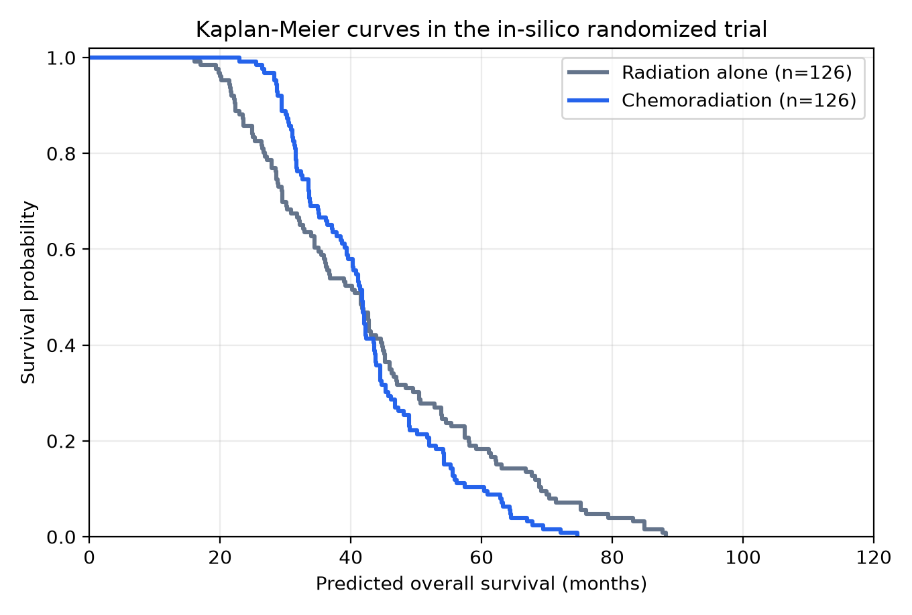
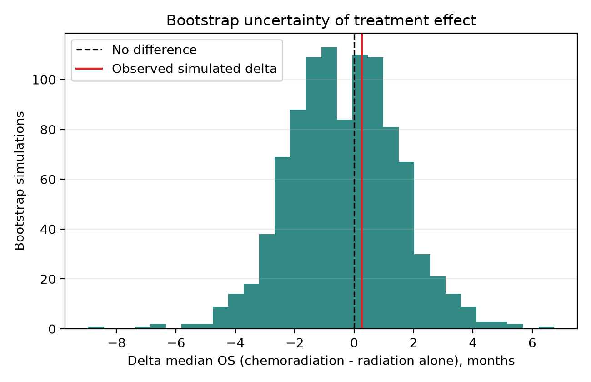
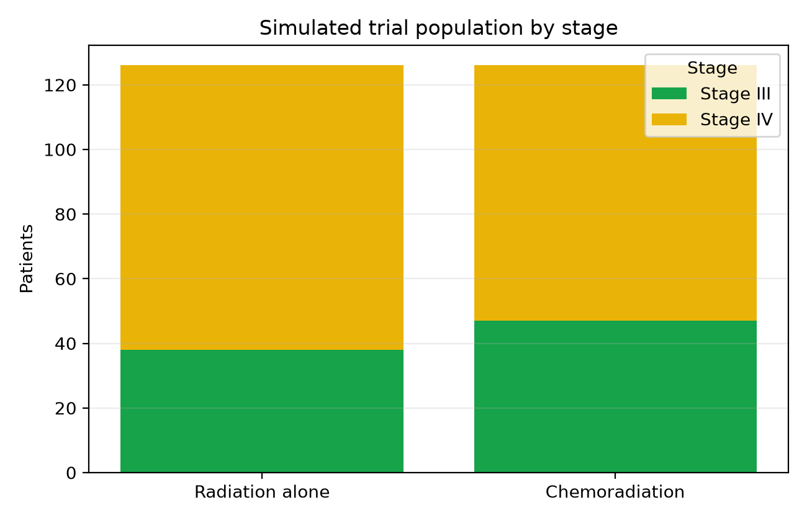

# Predictive modeling of outcomes in salivary gland cancers using machine learning: simulated prospective validation with the RTOG 1008 trial

Authors: Federico Lorenzo^1,2; Agustin Rosich^1,2; Jesica Lell^1,2; Sergio Aguiar^1; Valentina Ferreira^1; Karina Ochandorena^1,2; Eduardo Larrinaga^1; Natalia Gadea^1; Nicolas Larragueta^1; Aldo Quarneti^1

Affiliations: ^1 Radiotherapy, RT International Institute, Montevideo, Uruguay. ^2 Radiotherapy, Unidad Academica de Radioterapia, Montevideo, Uruguay, RT International Institute.

## Abstract

### Background
Salivary gland cancers are rare and biologically heterogeneous. Surgery followed by risk-adapted postoperative radiotherapy is widely used for high-risk disease, but the incremental value of concurrent chemotherapy remains uncertain. ASCO and ESMO-EURACAN do not recommend routine concurrent chemotherapy outside a clinical trial [1,2], and prior reviews emphasize the lack of definitive prospective evidence [4].

### Objective
To perform an RTOG 1008-like in-silico trial estimating whether concurrent chemoradiotherapy improves predicted overall survival compared with radiotherapy alone among patients with T3/T4 salivary gland cancer.

### Methods
We developed a retrospective predictive modeling pipeline using standardized SEER-derived salivary gland cancer data. Eligible patients had T3/T4 disease and received either radiotherapy alone or concurrent chemoradiotherapy. A predictive model was trained to support counterfactual treatment-specific survival estimation. We then simulated a 1:1 randomized trial with 252 patients, mirroring the planned Phase III sample size of RTOG 1008. The primary endpoint was predicted overall survival in months, administratively capped at 120 months. Uncertainty was estimated using 1,000 bootstrap simulations.

### Results
The eligible retrospective cohort included 954 T3/T4 salivary gland cancer patients treated with radiotherapy alone or concurrent chemoradiotherapy. The simulated RTOG 1008-like trial included 252 patients, with 126 assigned to chemoradiotherapy and 126 assigned to radiotherapy alone. Median predicted overall survival was 41.8 months with chemoradiotherapy and 41.5 months with radiotherapy alone, corresponding to a median difference of +0.3 months. The log-rank p-value was 0.1187. Across 1,000 bootstrap simulations, the mean overall survival difference was -0.3 months, with a 95% interval from -3.9 to +3.3 months. The probability that the simulated survival difference favored chemoradiotherapy was 0.436.

### Conclusions
In this in-silico emulation of an RTOG 1008-like trial, adding chemotherapy to radiotherapy did not produce a statistically robust predicted overall survival benefit in advanced T3/T4 salivary gland cancer. The principal value of this work is not to replace RTOG 1008, but to generate a transparent pre-results prediction that can be validated against the mature prospective results of RTOG 1008 and related trials.

## Introduction

Malignant salivary gland tumors are rare and histologically heterogeneous [1,2]. For resectable high-risk disease, surgery followed by postoperative radiotherapy is commonly recommended for adverse features such as T3/T4 disease, nodal involvement, high-grade histology, positive or close margins, perineural invasion, skin or bone involvement, and incomplete resection [1,2]. Advanced T stage, nodal disease, high grade, perineural invasion, and incomplete resection have repeatedly been associated with recurrence, distant metastasis, and inferior survival [5]. Population-based and institutional studies support postoperative radiotherapy for locally advanced or high-grade major salivary gland tumors [7,8], and a contemporary meta-analysis supports its role as the local-regional backbone of high-risk management [10].

Whether concurrent chemotherapy adds survival benefit to radiotherapy remains unresolved. Small institutional series suggested possible benefit [11,12], but larger SEER-Medicare and NCDB analyses did not confirm a consistent overall survival advantage [14,15]. More recent registry and propensity-adjusted studies similarly report no global survival benefit, while describing hypothesis-generating signals in selected very-high-risk subgroups [17-21]. RTOG 1008 is the pivotal prospective trial addressing this question; it compares adjuvant radiotherapy alone with radiotherapy plus weekly cisplatin in resected high-risk malignant salivary gland tumors [22-24]. Its Phase III overall survival endpoint and total sample size of 252 patients provide a natural benchmark for in-silico trial emulation [23,24]. Because existing salivary gland cancer models are mostly prognostic rather than predictive of chemotherapy benefit [25-31], the present study uses an RTOG 1008-like in-silico framework to generate a transparent pre-results prediction for future validation against prospective randomized evidence.

## Methods

### Study Design
We performed a retrospective in-silico trial emulation comparing concurrent chemoradiotherapy with radiotherapy alone in advanced T3/T4 salivary gland cancer. The analysis used observational SEER-derived data to approximate the randomized structure and Phase III sample-size benchmark of RTOG 1008.

### Data Source, Variables, and Eligibility
The analysis used a standardized SEER-derived dataset containing age, sex, ICD-O-3 histology, harmonized histology group, harmonized T and N stage, radiotherapy and chemotherapy indicators, time from diagnosis to treatment, cause-of-death recode, and survival time in months. Overall survival was administratively capped at 120 months. Cancer-specific death for model training was derived from the SEER cause-of-death site recode, with patients coded as alive treated as non-events.

TNM stage group was reconstructed from harmonized T and N variables; TX, T88, T0, NX, and N88 were classified as unknown and excluded from staged analyses. The trial-eligible cohort was restricted to patients with T3/T4 disease who received radiotherapy and were observed to receive either radiotherapy alone or concurrent chemoradiotherapy. This yielded 954 eligible patients from 4,657 standardized records.

The selection criteria intentionally approximate the high-risk structure of RTOG 1008, but they cannot reproduce it exactly. SEER-derived data do not reliably capture surgical margin distance, extranodal extension, perineural invasion, performance status, cisplatin eligibility, radiation dose and fields, chemotherapy drug, chemotherapy dose intensity, central pathology review, or exact time zero at the start of adjuvant radiotherapy. Accordingly, the study is described as RTOG 1008-like rather than a strict target-trial emulation.

### RTOG 1008-Like Emulation
RTOG 1008 compares adjuvant radiotherapy alone with radiotherapy plus weekly cisplatin in resected high-risk malignant salivary gland tumors [22-24]. In the present emulation, 252 patients were sampled from the eligible cohort, matching the planned Phase III sample size, and assigned 1:1 to chemoradiotherapy or radiotherapy alone using a fixed random seed. Predicted overall survival was estimated under each assigned treatment using treatment-specific outcome models.

### Predictive Modeling
A gradient boosting classifier was trained in the eligible cohort to predict 10-year capped cancer-specific mortality using age, sex, T stage, N stage, reconstructed stage group, histology group, and chemotherapy status. Numeric variables were median-imputed and standardized; categorical variables were imputed with the most frequent category and one-hot encoded. Performance was evaluated with five-fold stratified cross-validation using AUC, then the model was refit on the full eligible cohort.

Treatment-specific survival was estimated with separate random forest regressions trained among observed chemoradiotherapy and radiotherapy-alone patients. Predictors were age, sex, T stage, N stage, reconstructed stage group, and histology group. Each fitted model generated a predicted survival value under its corresponding treatment condition, and individual predicted chemotherapy benefit was defined as the difference between those values.

### Statistical Analysis
The primary endpoint was predicted overall survival in months, capped at 120 months. The primary contrast was the difference in median predicted overall survival between arms. The simulated trial was analyzed using Kaplan-Meier curves and a log-rank test. Uncertainty was assessed with 1,000 bootstrap simulations. Results are reported as predicted effects, not definitive causal estimates.

## Results

### Eligible Cohort
The eligible retrospective cohort included 954 patients with T3/T4 salivary gland cancer treated with radiotherapy alone or concurrent chemoradiotherapy.

### Simulated Trial Population
The simulated RTOG 1008-like trial included 252 patients, with 126 assigned to chemoradiotherapy and 126 assigned to radiotherapy alone. Table 1 describes the sampled population. The cohort was predominantly male, enriched for Stage IV disease, and included a broad mixture of salivary gland histologies, including squamous cell carcinoma, adenoid cystic carcinoma, adenocarcinoma, mucoepidermoid carcinoma, carcinoma NOS, and acinar cell carcinoma.

### Model Performance
The predictive model was a gradient boosting mortality classifier trained on 10-year capped cancer-specific mortality. The apparent AUC was 0.806, and the cross-validated AUC was 0.677 +/- 0.017.

### Primary In-Silico Trial Result
Median predicted overall survival was 41.8 months in the chemoradiotherapy arm and 41.5 months in the radiotherapy-alone arm. The median predicted overall survival difference was +0.3 months, with a log-rank p-value of 0.1187. Across 1,000 bootstrap simulations, the mean survival difference was -0.3 months. The bootstrap 95% interval ranged from -3.9 to +3.3 months. The probability that the survival difference was greater than zero was 0.436.

### Table 1. Simulated Trial Population Characteristics

See `tables/simulated_trial_population_characteristics.csv`.

### Table 2. Primary In-Silico Trial Result

See `tables/primary_in_silico_trial_result.csv`.

### Table 3. Simulated Trial Arm Outcome Characteristics

See `tables/simulated_trial_arm_characteristics.csv`.

### Figure 1. Kaplan-Meier Curves by Simulated Treatment Arm

### Figure 2. Bootstrap Distribution of the Predicted Treatment Effect

### Figure 3. Stage Distribution of the Simulated Trial Population

## Discussion

In this RTOG 1008-like in-silico trial of advanced T3/T4 salivary gland cancer, concurrent chemoradiotherapy did not demonstrate a robust predicted overall survival advantage over radiotherapy alone. The estimated median OS difference was small, the log-rank test was not significant, and the bootstrap interval crossed both potentially favorable and unfavorable values. This finding fits the current guideline posture: postoperative radiotherapy is established for high-risk features [1,2], while routine concurrent chemotherapy remains unsupported outside clinical trials [1,2]. RTOG 1008 exists precisely because prospective efficacy evidence for chemotherapy intensification has been lacking [22-24].

The first anchor for interpretation is the postoperative radiotherapy literature. Terhaard et al. identified T3/T4 disease and incomplete resection as adverse factors for recurrence, and T/N stage, high grade, and perineural invasion as adverse factors for distant metastasis and survival [5]. Mahmood et al. associated adjuvant radiotherapy with improved survival in high-grade and/or locally advanced major salivary gland tumors [7]. Schoenfeld et al. reported that postoperative IMRT was well tolerated and achieved high local control [8]. Hosni et al. emphasized that distant metastasis remains a dominant pattern of failure in high-risk subgroups despite postoperative radiotherapy [9]. Wang et al. synthesized the contemporary PORT literature and found support for local-regional benefit, while noting the lack of strong global evidence for added concurrent chemotherapy [10]. Parotid- and histology-specific series further support PORT for adverse features such as positive margins, high grade, and T3/T4 disease [33,34]. These studies support PORT as the local-regional backbone for high-risk salivary gland cancer, but they do not establish that chemotherapy adds a survival benefit to radiotherapy. Key postoperative radiotherapy studies are summarized in Table 4.

### Table 4. Key Postoperative Radiotherapy Studies

See `tables/key_postoperative_radiotherapy_studies.csv`.

The second anchor is the comparative chemoradiotherapy literature. Early institutional series suggested that concurrent chemotherapy might improve outcomes in selected high-risk patients [11,12]. Subsequent institutional comparisons did not show a clear survival advantage [13,16]. The SEER-Medicare analysis by Tanvetyanon et al. suggested worse outcomes among older patients receiving chemoradiotherapy [14], and the NCDB analysis by Amini et al. found no overall survival advantage for adjuvant chemoradiotherapy over radiotherapy alone [15]. More recent studies are similar in direction: Kang et al. found no OS or DSS benefit in advanced major salivary gland cancer [19], whereas Hsieh et al. and Shen et al. described potential benefit signals in nodal disease, R2 resection, adenoid cystic carcinoma, or very-high-risk combinations such as T3/T4 high-grade tumors with heavy nodal burden [20,21]. Our in-silico result similarly does not exclude benefit in a biologically enriched subgroup; it suggests that routine addition of chemotherapy across a broad T3/T4 population may not produce a large average survival gain.

The most important trial context is RTOG 1008. That study was explicitly designed because retrospective evidence was insufficient and conflicting: early small studies suggested possible benefit [11,12], whereas larger retrospective analyses failed to confirm a consistent survival advantage [14,15]. RTOG 1008 directly tests radiotherapy alone versus radiotherapy plus weekly cisplatin in resected high-risk malignant salivary gland tumors [22-24]. The GORTEC-REFCOR SANTAL study also evaluates radiotherapy with or without cisplatin in salivary gland and sinonasal tumors [32]. Together, these trials show that platinum radiosensitization remains a plausible research strategy, while ASCO and ESMO-EURACAN guidelines still do not endorse routine concurrent chemotherapy outside clinical trials [1,2]. Therefore, this manuscript should not be framed as a replacement for RTOG 1008. Its value is prospective falsifiability: it provides a pre-results prediction that can later be compared with the actual randomized results. If RTOG 1008 demonstrates a clinically meaningful OS benefit, that divergence will identify limitations in registry-derived prediction, missing covariates, treatment-agent specificity, or unmodeled biology. If RTOG 1008 does not demonstrate benefit, this in-silico analysis may support the interpretation that chemotherapy should not be routinely added to radiotherapy outside selected subgroups or trials.

This work also highlights the difference between prognostic and predictive modeling. Existing salivary gland models estimate recurrence risk [26], postoperative survival [27,28], distant metastasis risk [25], random-survival-forest-based prognosis [29], machine-learning survival prediction [30], or survival benefit from postoperative radiotherapy [31]. Those tools can identify patients with poor prognosis, but high risk does not automatically imply high chemotherapy benefit. A useful treatment-selection model must estimate differential outcome under competing treatments. Future iterations should therefore incorporate causal survival methods, including inverse probability weighting, overlap weighting, doubly robust Cox models, causal forests, causal survival forests, or uplift modeling on fixed-time survival endpoints.

## Limitations

This is a retrospective in-silico emulation, not a randomized trial. Treatment assignment in the source data was observational, and key RTOG 1008 variables were unavailable or incomplete, including margin status, extranodal extension, perineural invasion, performance status, chemotherapy agent, chemotherapy dose intensity, radiation dose, and exact treatment timing.

Salivary gland cancer is biologically heterogeneous. Pooling histologies improves sample size but may dilute subtype-specific treatment effects. Finally, the endpoint is predicted survival rather than prospective observed survival; the intended use of this analysis is hypothesis generation and future validation against RTOG 1008.

## Conclusion

An RTOG 1008-like in-silico trial did not predict a statistically robust survival benefit from adding chemotherapy to radiotherapy in T3/T4 salivary gland cancer. The result aligns with the broader retrospective literature, which does not support routine chemoradiotherapy for all high-risk salivary gland cancer patients but leaves open the possibility of benefit in selected very-high-risk subgroups. The central contribution of this work is a reproducible, pre-results prediction designed for validation against RTOG 1008 and related prospective evidence.

## References

1. Geiger JL, Ismaila N, Beadle B, Caudell JJ, Chau N, Deschler D, et al. Management of Salivary Gland Malignancy: ASCO Guideline. J Clin Oncol. 2021;39:1909-1941. doi:10.1200/JCO.21.00449.
2. van Herpen C, Locati LD, But-Hadzic J, Bossi P, Cavalieri S, Licitra L, et al. Salivary gland cancer: ESMO-EURACAN Clinical Practice Guideline for diagnosis, treatment and follow-up. ESMO Open. 2022. PMID:36567082.
3. PDQ Adult Treatment Editorial Board. Salivary Gland Cancer Treatment (PDQ). National Cancer Institute; updated 2025.
4. Cerda T, Sun XS, Vignot S, et al. A rationale for chemoradiation versus radiotherapy in salivary gland cancers? Crit Rev Oncol Hematol. 2014;91:142-158. PMID:24636481.
5. Terhaard CHJ, Lubsen H, van der Tweel I, Hilgers FJM, Eijkenboom WMH, Marres HAM, et al. Salivary gland carcinoma: independent prognostic factors for locoregional control, distant metastases, and overall survival: results of the Dutch head and neck oncology cooperative group. Head Neck. 2004;26:681-693. PMID:15287035.
6. Mendenhall WM, Morris CG, Amdur RJ, Werning JW, Hinerman RW, Villaret DB. Radiotherapy alone or combined with surgery for salivary gland carcinoma. Cancer. 2005;103:2544-2550. PMID:15880750.
7. Mahmood U, Koshy M, Goloubeva O, Suntharalingam M. Adjuvant radiation therapy for high-grade and/or locally advanced major salivary gland tumors. Arch Otolaryngol Head Neck Surg. 2011. PMID:22006781.
8. Schoenfeld JD, Sher DJ, Norris CM Jr, Haddad RI, Posner MR, Balboni TA, et al. Salivary gland tumors treated with adjuvant intensity-modulated radiotherapy with or without concurrent chemotherapy. Int J Radiat Oncol Biol Phys. 2012;82:308-314. PMID:21075557.
9. Hosni A, Huang SH, Goldstein D, Xu W, Chan B, Hansen A, et al. Outcomes and prognostic factors for major salivary gland carcinoma following postoperative radiotherapy. Oral Oncol. 2016;54:75-80. PMID:26723908.
10. Wang J, et al. The Current Position of Postoperative Radiotherapy for Salivary Gland Cancer: A Systematic Review and Meta-Analysis. Cancers. 2024;16:2375.
11. Pederson AW, Salama JK, Haraf DJ, Witt ME, Stenson KM, Portugal L, et al. Adjuvant chemoradiotherapy for locoregionally advanced and high-risk salivary gland malignancies. Head Neck Oncol. 2011;3:31. PMID:21791072.
12. Tanvetyanon T, Qin D, Padhya T, McCaffrey J, Zhu W, Boulware D, et al. Outcomes of postoperative concurrent chemoradiotherapy for locally advanced major salivary gland carcinoma. Arch Otolaryngol Head Neck Surg. 2009;135:687-692. doi:10.1001/archoto.2009.70.
13. Mifsud MJ, Tanvetyanon T, McCaffrey JC, Otto KJ, Padhya TA, Kish J, et al. Adjuvant radiotherapy versus concurrent chemoradiotherapy for the management of high-risk salivary gland carcinomas. Head Neck. 2016;38:1628-1633. doi:10.1002/hed.24484.
14. Tanvetyanon T, Fisher K, Caudell J, Otto K, Padhya T, Trotti A. Adjuvant chemoradiotherapy versus radiotherapy alone for locally advanced salivary gland carcinoma among older patients. Head Neck. 2016;38:863-870. PMID:26340707.
15. Amini A, Waxweiler TV, Brower JV, Jones BL, McDermott JD, Raben D, et al. Association of adjuvant chemoradiotherapy vs radiotherapy alone with survival in patients with resected major salivary gland carcinoma: data from the National Cancer Data Base. JAMA Otolaryngol Head Neck Surg. 2016;142:1100-1110. doi:10.1001/jamaoto.2016.2168.
16. Gebhardt BJ, Ohr JP, Ferris RL, Duvvuri U, Johnson JT, Kim S, et al. Concurrent chemoradiotherapy in the adjuvant treatment of salivary gland malignancies. Am J Clin Oncol. 2018;41:888-893. PMCID:PMC6587550.
17. Hsieh CE, Lin CY, Lee LY, Yang LY, Wang CC, Wang HM, et al. Adding concurrent chemotherapy to postoperative radiotherapy improves locoregional control but not overall survival in patients with salivary gland adenoid cystic carcinoma: a propensity score matched study. Radiat Oncol. 2016;11:47. doi:10.1186/s13014-016-0617-7.
18. Yan W, Huang S, et al. Postoperative chemoradiotherapy versus radiotherapy alone for major salivary gland malignancies: a stratified study based on the external validation of the distant metastasis risk score model. Cancers. 2022;14:5583.
19. Kang NW, Kuo YH, Wu HC, Ho CH, Chen YC, Yang CC. No survival benefit from adding chemotherapy to adjuvant radiation in advanced major salivary gland cancer. Sci Rep. 2022;12:20862. doi:10.1038/s41598-022-25468-9.
20. Hsieh RCE, et al. A multicenter retrospective analysis of patients with salivary gland carcinoma receiving postoperative chemoradiotherapy versus postoperative radiotherapy. Radiother Oncol. 2023. PMID:37659659.
21. Shen Y, Shan J. Chemoradiotherapy versus radiotherapy in high risk salivary gland cancer. World J Surg Oncol. 2024;22:181. doi:10.1186/s12957-024-03456-9.
22. NRG Oncology. RTOG-1008: A randomized phase II/phase III study of adjuvant concurrent radiation and chemotherapy versus radiation alone in resected high-risk malignant salivary gland tumors. NRG Oncology protocol page.
23. NRG Oncology. RTOG 1008 protocol, version 11/5/2015. Required sample size: Phase II 120; Phase III 252.
24. ClinicalTrials.gov. Radiation Therapy With or Without Chemotherapy in Treating Patients With High-Risk Malignant Salivary Gland Tumors. Identifier: NCT01220583.
25. Lukovic J, Sultana R, et al. Development and validation of a clinical prediction-score model for distant metastases in salivary gland cancer. Oral Oncol. 2020. PMID:31959347.
26. Ali S, Palmer FL, Yu C, DiLorenzo M, Shah JP, Kattan MW, et al. A predictive nomogram for recurrence of carcinoma of the major salivary glands. JAMA Otolaryngol Head Neck Surg. 2013;139:698-705. doi:10.1001/jamaoto.2013.3347.
27. Ali S, Palmer FL, Yu C, DiLorenzo M, Shah JP, Kattan MW, Patel SG, Ganly I. Postoperative nomograms predictive of survival after surgical management of malignant tumors of the major salivary glands. Ann Surg Oncol. 2014;21:637-642. PMID:24132626.
28. Hay A, Migliacci J, Karassawa Zanoni D, et al. Validation of nomograms for overall survival, cancer-specific survival and recurrence in major salivary gland cancer. Head Neck. 2018. PMID:29389040.
29. Chen Y, Li Y, et al. Prognostic risk factor of major salivary gland carcinomas and survival prediction model based on random survival forests. Cancer Med. 2023. PMID:36934429.
30. Du W, et al. Prognostic prediction model for salivary gland carcinoma based on machine learning. 2024. PMID:38981745.
31. Jacobs CD, et al. Prediction model to estimate overall survival benefit of postoperative radiation therapy for resected major salivary gland cancers. Oral Oncol. 2022. doi:10.1016/j.oraloncology.2022.105902.
32. GORTEC/REFCOR. Treatment of Salivary Glands and Nasal Tumors (SANTAL). ClinicalTrials.gov Identifier: NCT02998385.
33. Kim YH, et al. Evaluation of prognostic factors for the parotid cancer treated with surgery and postoperative radiotherapy. Cancer Res Treat. 2020. PMID:31480828.
34. Park G, et al. Postoperative radiotherapy for mucoepidermoid carcinoma of major salivary glands: long-term results of a single-institution experience. Radiat Oncol J. 2018. PMID:30630270.
35. Katano A, et al. Postoperative radiotherapy for malignant major salivary gland tumors. 2023.
